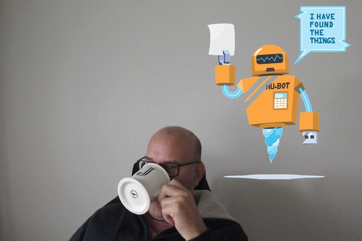

---
{
    layout: './pages/layouts/post.html',
    image: '',
    title: 'Resuscitating Hubot',
    excerpt: "According to GitHub stats, Hubot development stalled after 2015. There was a little bit of activity in 2017 and 2019, but not enough to consider the codebase under active development. I'm resuscitating Hubot.",
    shouldPublish: true,
    published: new Date('2023-06-13T19:25:22.000Z'),
    tags: ['hubot', 'chatbot', '2014'],
    image: '/meandhubot.jpg',
    uri: '/blog/2023/resuscitating-hubot.html'
}
---
# Resuscitating Hubot

I'm resuscitating [Hubot](https://hubotio.github.io/hubot/).

Because I've always loved chatops. A bot at my fingertips that I can program to help me and all my friends, too.

I know, it's probably for naught. Everyone has moved on. Slack built [BoltJS](https://slack.dev/bolt-js/). Microsoft built [BotFramework](https://dev.botframework.com), and Discord has [discord.js](https://discord.js.org).

But Hubot is so cute.

Development on its [codebase](https://github.com/hubotio/hubot/) stalled. The last time any significant changes happened was around [2015](https://github.com/hubotio/hubot/graphs/contributors).

I started this journey by posting an [issue](https://github.com/hubotio/hubot/issues/1504) in August, 2019, asking what was happening. Crickets.

I followed up with another issue in April, 2020, which received more responses. But I think the maintainers had also moved on from Hubot, and Github (many were employees). Sadness took hold. A glimmer of hope came from a couple of people posting supportive comments on that issue, though. Which boosted my motivation.

In April, 2023, I emailed one of the Hubotio owners and they responded. They were a Hubot contributor prior to jointing GitHub about 9 years ago and have been super helpful; reviewing my first Pull Request (PR) and merging it, resulting in the first [release](https://github.com/hubotio/hubot/releases/tag/v3.4.0) (published to npmjs) since March, 2019.

Hello, [Hubot](https://hubotio.github.io/hubot/). Again. It's nice to see you.

